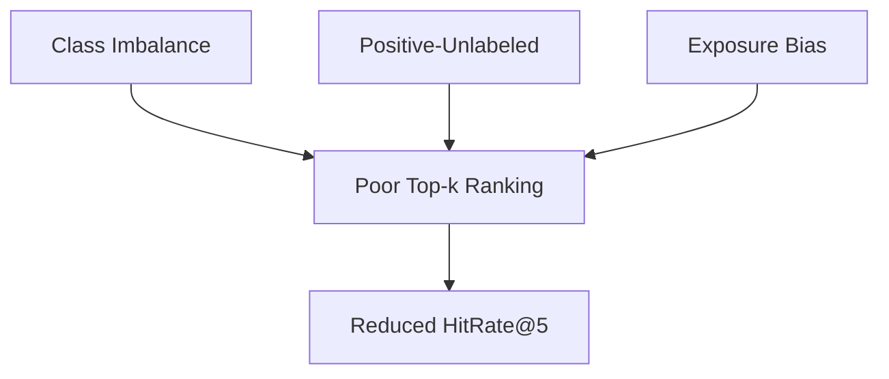
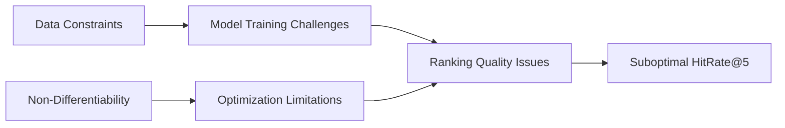

# 🚀 Social Media Post Recommendation System

[](https://www.python.org/)
[](https://fastapi.tiangolo.com/)
[](https://catboost.ai/)
[](LICENSE)

**Production-grade recommendation system** for personalized post suggestions in a student social network. This solution analyzes user behavior, content features, and temporal patterns to deliver relevant content recommendations in real-time.

## 📊 Business Overview

### Problem Statement
KarpovCourses social network needs to improve user engagement by replacing random posts in users' feeds with **personalized recommendations**. The challenge is to leverage user profiles, post content, and interaction history to predict which posts a user is most likely to engage with.

### Key Objectives
- ✅ Predict top-5 posts a user will like at any given time
- ✅ Achieve high hitrate@5 metric
- ✅ Handle production load (response < 0.5s per request)
- ✅ Efficient memory usage (< 4GB RAM)


## 📊 Evaluation Metric and Proxy Metric Selection

### Target Metric: HitRate@5
The core performance metric is defined as:
<p align="center">
  
</p>

Where:
-  = Test user set
- }\in\{0,1\}) = Like indicator for j-th recommendation
- ) = Indicator function

**Interpretation**: Metric = 1 if user liked at least one of top-5 recommended posts.

### 🚧 HitRate@5 Optimization Challenges

#### 1. Non-Differentiable Nature
Threshold-based nature prevents direct gradient-based optimization.

#### 2. Data-Related Constraints
Three interconnected data challenges complicate optimization:

| Challenge | Description | Impact on HitRate@5 |
|-----------|-------------|---------------------|
| **Class Imbalance** | 11% conversion rate (likes vs. non-likes) | Increases difficulty of identifying signal for top-k selection |
| **Positive-Unlabeled Problem** | Non-liked interactions ≠ true negatives | Distorts probability calibration critical for ranking |
| **Exposure Bias** | Missing data for unshown posts | Limits model's ability to discover novel recommendations |



#### 3. Top-k Ranking Sensitivity  
HitRate@5 depends entirely on:
- Precise ordering of top-5 recommendations
- Sharp probability differences at the decision boundary
- Robustness to popularity bias effects



### ROC-AUC Justification
To overcome these intertwined challenges **a differentiable proxy metric (ROC-AUC) was optimized** during model training.

**Theoretical relation**:
<p align="center">
  
</p>

**Key properties**:
- Robust to class imbalance
- Measures ranking quality critical for top-5 recommendations
- Threshold-invariant

**Empirical evidence**:
- Temporal stability across validation periods
- Superior performance in final checker tests

### Optimization Strategy
1. Train model with `LogLoss`  
   
   
2. Hyperparameter tuning via ROC-AUC on validation set

3. Rank posts by predicted like probability:  
   
   
4. Select top-5 highest probability posts

### 🧠 Model Architecture & Training

#### Production Model: `catboost_min_features.cbm`

#### Final Configuration:

```python
CatBoostClassifier(
    iterations=60,
    learning_rate=1.0,
    depth=2,
    random_state=42,
    cat_features=[
        'topic', 'TextCluster', 'gender', 'country',
        'city', 'exp_group', 'time_of_day', 'is_weekend',
        'request_day_of_week', 'request_month'
    ]
)
```

#### Full Feature Space (33 features):

```python
# Post features
['topic', 'views', 'view_reach', 'TotalTfIdf', 'MaxTfIdf', 'MeanTfIdf',
 'TextCluster', 'DistanceTo1thCluster', ..., 'DistanceTo15thCluster',

# User features
'country', 'gender', 'age', 'city', 'exp_group',

# Temporal features
'request_hour', 'request_day_of_week', 'request_month',
'request_week', 'is_weekend', 'time_of_day']
```


#### Gradient Decay Experiments

Tested progressive learning rate reduction through sequential training:


  